I am [Miquel Suau](https://www.linkedin.com/in/miquel-suau-gonz%C3%A0lez-346b5617a/), student of the [Bachelor’s Degree in Video Games by UPC at CITM](https://www.citm.upc.edu/ing/estudis/graus-videojocs/). This content is generated for the second year’s subject Project 2, under supervision of lecturer [Marc Garrigó](https://www.linkedin.com/in/mgarrigo/).

---

<br>

# Why is Space Partitioning necessary

Let's set up a context, let's say you have 100 objects in a scene, and some are really close, some are really far away. We as humans who can see distances, instinctively only look around an object to check if something is colliding with it, right?

Well computers can't do that, when we ask the computer to check collisions, it's pretty common to just make a double FOR loop and check every object with every other object in the scene (brute force). This results in an operating time of O(n²) which means that if we have 100 units, we'll need to compute O(100²) = 10.000 checks. Keep that number in mind.

Also note that we can't just ask the computer to get the distance of every object and then check only the closest ones, because... we would be iterating every object anyway so it would be even worst.

So, we don't want to work with O(n²) because if we start adding objects, checks can grow fast and create problems. We need to work with something like O(n log n), which is the operating time of a Quadtrees and AABB Trees. This means that in the same 100 unit's context, we just need to compute O(100 * log(100)) = 200, big improvement from 10.000 to 200 isn't it? (Keep in mind that usually Quad trees operate in O(log n), but we are checking every element of the leaf with every other element so we need to multiply that O(log n) with every element in the leaf).

<br>
<p align="center">
This is a gif with a theroical tree construction:
	<br>
 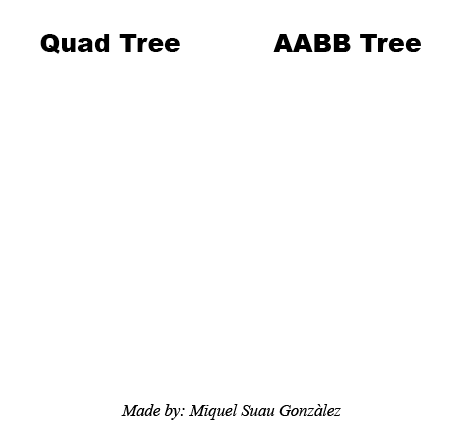
</p>
<br>

Keep in mind that if we are working with a limited number of objects and this number is relatively small, we could just brute force the checks. Trees are useful when we work with a dynamic unlimited number of objects. Also, a bad implemented tree can be slower than some brute force checks, so I recommend to read this page until the end.

Here is a small table to represent the big improvement:


| Units         | O(n²)              |  O(n log n)  |
| ------------- |:------------------:| ------------ |
| 100           | 10.000      checks | 200 checks   |
| 1.000         | 1.000.000   checks | 3.000 checks |
| 10.000        | 100,000,000‬ checks | 40.000 checks|

There's also lots of data tree structure, like Octree used in 3D space.

---

<br>

# Different approaches by different games

There are a lot of games using Space Partitioning these days, it's almost a "must", but in the old days of video games, space partitioning wasn't so common. Some games like **DOOM**, **Quake** and **Wolfenstein** used BSP implementations to render 3D graphics.

DOOM used a BSP (Binary Space Partitioning) tree to solve the VSD problem. This BSP allowed the DOOM developers to build complex 3D maps that could be rendered in real with slow PC's.

Wolfenstein in the other hand used a marching request method and build the maps in a grid, making the rendering process fast enough for slow computers, but this also created a limiting factor on the level design aspect in the game.

You can read more about VSD and BSP [here](https://twobithistory.org/2019/11/06/doom-bsp.html).

Also, any RTS game or any other game that manages large numbers of entities must use space partitioning to manage units, collisions, logic...

There is not a lot of info about it, but games like [World War Z](https://www.epicgames.com/store/es-MX/product/world-war-z/home) must use some sort of space partitioning or ECS system to work with large amounts of entities.

<br>
<p align="center">
 
</p>
<br>

It's safe to say that almost any modern game engine uses trees for camera culling, collision detection, raycast rendering...
For instance, Unreal Engine 3 uses BSP trees.

---

<br>

# How can we solve this problem

So, space partitioning can lead to a lot of implementations depending on what you want to solve, if you are doing a 3D renderer, you want to solve something like the VSD problem and then you need to create some sort of BSP tree or frustum culling to render a 3D space into a 2D surface.

<br>
<p align="center">
Dungeon generation with BSP Tree:
	<br>
 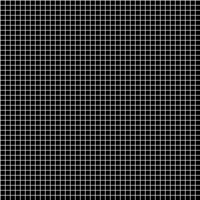
</p>
<br>

If you are dealing with large amounts of objects for an RTS game, or any other game, maybe you want to work with AABB trees, Octrees (3D context) or QuadTrees (2D context).

In our case, we want the user to be able to deal with large amounts of entities, like buildings, units, props...

We will create a QuadTree to manage static entities, and a AABBTree to manage everything related to dynamic entities (collision, culling, logic...).

To start with this, we will work with some custom structs, like Point and Rect, some math functions and the .h and .cpp files provided [here](#lets-code-c-implementation).

We will create a working QuadTree and AABBTree and some functions to use them, recursivity will be a recursive topic here (pun intended).

---

<br>

# Custom trees documentation

Here you can find information for all the custom functions in the AABBTree and QuadTree classes, Point and Rect structs and MaykMath namespace:

<br>

**AABB Tree data documentation**

_AABBNode_ :
<br>

| Type         | Function Declaration    | Function description  |
| ------------ |:-----------------------:|:---------------------:|
| void         | Init(AABBTree*, AABBNode*, int, int, int, int)  | Initialize node data     |
| Rect         | GetRect()   | Returns the node rect     |
| std::list<Entity*>*         | GetData()   | Returns a pointer to the node data list    |
| std::list<Entity*>         | GetDataValue()    | Returns a copy of the node data list    |
| void         | UpdateNode()  | Updates the node min and max positions     |
| static void         | SubDivide(AABBNode&)  | Creates a node subdivision and distributes the old node data     |

<br>
<br>
_AABBTree_ :
<br>

| Type         | Function Declaration    | Function description  |
| ------------ |:-----------------------:|:---------------------:|
| void         | Init(int, int, int, int)  | Initialize tree data     |
| void         | AddUnitToTree(Entity&)   | Adds a unit to the tree by positions and manages subdivisions     |
| void         | UpdateAllNodes(AABBNode& node)   | Updates all tree nodes with recursivity    |
| AABBNode*    | FindLowestNodeInPoint(AABBNode*, const Point)    | Returns a pointer to the lowest node inside a point    |
| void         | LoadLeavesToList(AABBNode*, std::list<AABBNode*>&)  | Loads all the leaves in a list    |
| void   | LoadLeafNodesInsideRect(AABBNode*, std::vector<AABBNode*>&, Rect&)| Loads all leaves inside the rect  |
| void   | Clear()| Deletes the tree if it's a pointer  |

<br>
<br>

**Quad Tree data documentation**

_QuadNode_ :
<br>

| Type         | Function Declaration    | Function description  |
| ------------ |:-----------------------:|:---------------------:|
| void         | Init(QuadTree*, QuadNode*, int, int, int, int)  | Initialize node data     |
| void         | SetRect(int&, int&, int&, int&)   | Sets the rect info |
| Rect        | GetRect()    | Returns the node rect    |
| const std::list<Entity*>*         | GetContent()    | Resturs a pointer to the data list    |
| static void          | SubDivide(QuadNode&, int)  | Subdivides the tree X number of times     |

<br>
<br>

_QuadTree_ :
<br>

| Type         | Function Declaration    | Function description  |
| ------------ |:-----------------------:|:---------------------:|
| void         | Init(TreeType, int, int, int, int)  | Initialize tree data     |
| void         | AddEntityToNode(Entity&, Point)   | Adds an entity to the tree by positions and manages subdivisions     |
| void |LoadNodesToList(std::list<QuadNode*>*, QuadNode*, Point, Point) | Loads all nodes overlaping with the point in a list|
| void    | FindLowestNodeInPoint(QuadNode*, const Point&)    |Finds the leaf inside a point  |
| static bool         | CheckNodeOverLap(Rect, Rect)  | Checks off axis rect overlap  |
| static Point   | CoordsToIsometricInt(Point, Point)| Transforms input to isometric space  |
| void   | Clear()| Deletes the tree if it's a pointer  |

<br>
<br>

**Point struct documentation**


| Type         | Function Declaration    | Function description  |
| ------------ |:-----------------------:|:---------------------:|
| float        |  DistanceManhattan(const Point& v) const  | Returns the Manhattan distance between two points |
| bool        |  IsZero()  | Returns true if X and Y are equal to 0 |
| float        |  operator*(Point const &b)   | Overrides the operator* to allow dot product between Points|

<br>
<br>

**Rect struct documentation**


| Type         | Function Declaration    | Function description  	      |
| ------------ |:-----------------------:|:----------------------------------:|
| Point        |  GetCentralPoint()      | Returns the rect's central point   |

<br>
<br>

**MaykMath namespace documentation**


| Type         | Function Declaration    | Function description  |
| ------------ |:-----------------------:|:---------------------:|
| Point| NegatedYVectorFromPoints(Point, Point)  | Calculate a vector from two points and invert the Y (we need this for OA detection)|
| float        | GetTriangleArea(Point, Point, Point)   | Calculate and return the area of any triangle  |
| bool  | IsPointInsideOffAxisRectangle(Point, Point, Point, Point, Point)| Returns true if the Point is inside an OA rectangle |
| bool        | IsPointInsideAxisAlignedRectangle(Rect, Point)   | Returns true is the point is inside the AA rectangle |
| bool        | CheckRectCollision(const Rect&, const Rect&)   | Returns true if the input rects are overlaping  |
| Point        |  GetMinPoint(Point, Point)   | Returns a Point with the minimum values of the two input Points  |
| Point        |  GetMaxPoint(Point, Point)   | Returns a Point with the maximum values of the two input Points  |


---
<br>

# Links to more documentation

To do this, you will need some knowledge about trees, recursivity and C++, these are some pages I recommend reading before starting with the code.

[Introductory Guide to AABB Tree Collision Detection](https://www.azurefromthetrenches.com/introductory-guide-to-aabb-tree-collision-detection/)

[Binary Search Trees](https://brilliant.org/wiki/binary-search-trees/)


Also read about the ways to find data in trees, for example, when we want to find the lowest nodes or leaves in our tree, we will use a recursive Depth-first search.

<br>
<p align="center">
 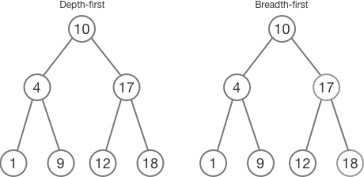
</p>
<br>

---

<br>

# LET'S CODE: C++ Implementation

---

<br>

**_TODO 0: Project Setup:_**

_WARNING:_ Keep in mind that debug mode can kill performance in visual studio. Don't trust me? Then let me show you some numbers:

| Check Method      | Units    | Debug Mode     | Release Mode |
| ----------------- |:--------:| --------------:| ------------:|
| Brute Force       | 1560     | ≃ 9.254,18 ms  | ≃ 52,41 ms  | 
| AABB Tree         | 1560     | ≃ 243,79 ms    | ≃ 6,04 ms   | 

<br>

_Brute Force:_

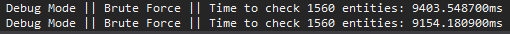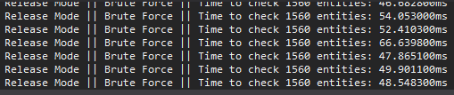

_AABB Tree::_

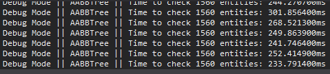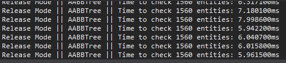

You can download the VS project with all the necessary files and the steps to complete the trees yourself [here](). The complete VS project with the trees working and the examples can we downloaded clicking [here](). If you want to download any file from the repository, you can go [here]().

##### **_NEVER remove the license or the name of the creator from the provided files. It's not your code, don't be "that" guy._**

Now, try to spawn some units, by default the project will use BRUTE FORCE collision detection. Can you feel the FPS dying? Cool, let's fix that.

---

<br>

**_TODO 1.1: Create tree variables:_**

Not a big deal, you can create them at any module you want, but I recommend to do it on the module that manages the entities.

Variable declaration:

```cpp
QuadTree quadTree;
AABBTree aabbTree;
```

---

<br>

**_TODO 1.2: Initialize quadTree:_**

Now, first off, we need to initialize the QuadTree, AABBTree does NOT need initialization because it's dynamic.

_TIP: Don't get fooled, {0, 0} in orthographic is not the same as {0, 0} in isometric. Trees work in pixels not in isometric._

_TIP 2: App->map->data.width is the NUMBER of tiles,  "App->map->data.tile_width" is the size of an individual tile. And maybe you need to add half a tile width to the tree X. ;)_

You can look up to find out how the Init method works, but its really simple, just set the map type, the starting X and Y and the width  and height in pixels.
	
---

<br>

**_TODO 2: Create a way to draw the trees for debugging:_**

Let's start with recursivity then, just uncomment this methods in the j1Render.h  and j1Render.cpp file.

```cpp
bool DrawQuadTree(TreeType, QuadNode&);
bool DrawAABBTree(AABBNode&);
```

Start with the DrawAABBTree(AABBNode&), when we call this function we use the baseNode variable of the tree as input, this is a recursive function so we just need to iterate all the nodes of the tree, and draw every Rect.

We COULD create a casting override to convert from Rect to SDL_Rect with (SDL_Rect)node.GetRect() like this:
```cpp
operator SDL_Rect() const
{
	return {x, y, w, h };
}
```

But we are trying to make the code as generic as possible, so we'll do the ugly way.

We have no isometric mode in AABBTree so we can render it as a normal quad. First off, get the node Rect with GetRect() and converted as an SDL_Rect. Then check if the rect W and H are different to 0.

After this we just render a quad with DrawQuad(quad, 255, 0, 0, 0, false). We use false at the end to render the quad without filling.

Then, and this is the most important part, we create a FOR loop from 0 to AABBNODE_CHILD_NUMBER, and call DrawAABBTree(node.childNodes[i]). 

Congrats, you created a recursive method.

Now let's do the same with DrawQuadTree(), we have two types of render, OFF AXIS and AXIS ALIGNED (ISOMETRIC or ORTHOGRAPHIC). We can't render off axis quads, so we need to draw the quad line by line. This means that we need to see the quad of the node as some sort of vectors.

I'll let the code commented here, so you just need to look at it, but try to understand what each DrawLine() means, basic vector knowledge should be enough. You also need to add the recursive part of the method, which is the same for loop as the DrawAABBTree() method but with QUADNODE_CHILD_NUMBER.

**_TIP: Remember to check if the node.isDivided is true before rendering the  children, if the node is not divided, there is no  child to render and the code will fail. Also this for loop needs to be called AFTER we render the current node._**


You will know if you initialize the trees correctly if it does look like this, if not, maybe you are using the wrong numbers.

<br>
<p align="center">
 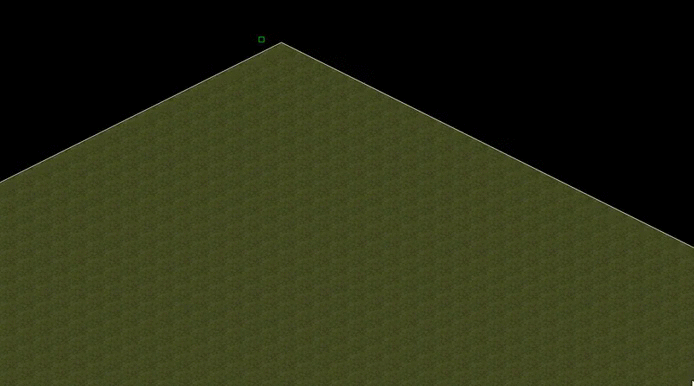
</p>
<br>

---

<br>

**_TODO 3: Make sure to update all the AABBTree nodes:_**

Let's move to node update now, AABBTree is a dynamic tree, so we need to update it every frame. The difference with some trees is that they need to be destroyed and created again every frame, but we only use 2 points to work with AABBTrees so we just need to update this points as a recursive method with the data from the leaves.

We only have the data at the leaves, so to update the nodes we need to travel to the leaf, update it, and then go back to the parent and update it with the info of its two children. We do this until the node we are working on has no parent. If you want to know how this works, look up the code inside the UpdateNode() and UpdateAllNodes() methods.

Just go to your favorite Update() override and call aabbTree.UpdateAllNodes() with aabbTree.baseNode as input, we update the points with recursivity so let the tree handle all the work.

**_TIP: If you move the units, update the tree AFTER all the units are moved in the frame, this can fix a lot of problems in the future._**

---

<br>

**_TODO 4: Fill the code for CreateBuildingEntity() method:_**

Now let's move to the file that manages entities, we already have a CreateUnitEntity() and CreateBuildingEntity() methods, but they are almost empty. To work with these trees we need to add pointers to the entities to the tree and its nodes, but don't worry, the trees will handle almost all the work for you.

_Use quadTree.AddEntityToNode() to add an entity by it's position._

Make sure that two buildings can't spawn in the same tile, just use the "FindLowestNodeInPoint()" method to find the lowest node, and then iterates all the data elements of that node and compare their position with the input of CreateBuildingEntity(). 

If any of those points is the same as yours (it's an isometric context, so you have to convert the check inside the **if** to App->map->WorldToMap(pos.x + App->map->data.tile_width / 2, pos.y) and the same with the the item you are checking against (*it).position) then you can just return nullptr out of the function because you are trying to spawn a unit in the same place as an already existing one.

---

<br>

**_TODO 5: Fill the code for CreateUnitEntity() method:_**

Exactly the same as last TODO, but with units, so we use "App->scene->aabbTree.AddUnitToTree()" this time.

Make sure that two units can't spawn in the same position.

---

<br>

**_TODO 6.1: Complete the missing code in the AABBTree::SubDivide() method:_**

I'll keep the hardest parts of the code, but try to complete it yourself. This is the logic you need to follow:

 - Check if the node is divided.
 - Push AABBNODE_CHILD_NUMBER times an empty AABBNode() to the node.childNodes list
 - Init the two new children like (node.root, &node, ....) with child 0, init at node.minPos, with child 1 use node.maxPos.
 - Distribute the data of the node to the new ones. This part is hard so I'll let the code commented in, but try to understand what I'm doing here. We use the distance of the entity between the min and max node points and sent it to the closest one.
 - Set this node isDivided as true and clear this node data list.
 
 _COOL_, now you can add as much units as you want and you should see the AABBTree dividing every AABBNODE_CHILD_NUMBER units added.

<br>

<p align="center">
  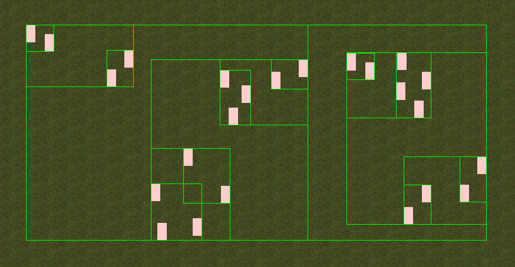
</p>

---

<br>

**_TODO 6.2: Complete the missing code in the QuadTree::SubDivide() method:_**

QuadTrees are easy to subdivide, the worst part of this is to find a way to check if a point is inside an off axis rectangle, and it took me longer than what I'll ever admit.

This is the logic you need to follow:

 - Check if node.root.lowest_height > node.h, if it is, set node.root->lowest_height = node.h.
 - Check if the divisionsLeft > 0, if it is, keep these steps, else you can return. 
 - Check if the node is divided. If it is, return.
 - Cool we can now just push QUADNODE_CHILD_NUMBER times and empty QuadNode() to the node.childNodes list.
 - Be aware of the code inside the switch, how we use different coords if its isometric. (Try to understand why we are using this points).
 - Set the node.isDivided as true.

That's all _COOL_ now you can divide the QuadTree too.

<br>

<p align="center">
  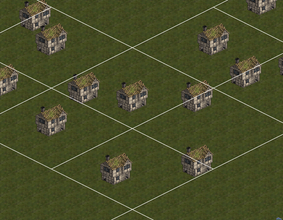
</p>

---

<br>

**_TODO 7: Test collision detection in Debug and Release mode:_**

There will be a big difference in time between debug and release mode, keep that in mind.

Go to EntityManager PostUpdate() method, we've been using brute force checks unitl now, you can slap a big comment in that code and uncomment the Tree collision code. Now compile in debug and release and check the times with the dynamic AABBTree. If you go to the Update() method, where you spawn units, you can comment the current code and uncomment the for under it, this will fill the map with units when you click. Enjoy the show.

<br>

<p align="center">
  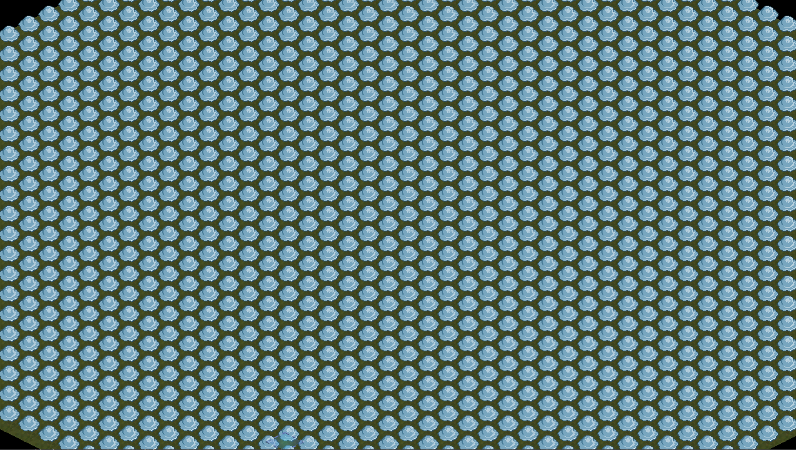
</p>

---

<br>

**_TODO 8: Test unit to building collision:_**

We also want to try Building to Unit collision detection, so uncomment the code inside the current collision detection method called //BuilToUnit.

Now you can throw those units to the buildings with freedom. again, keep in mind that this is WAY faster than brute force.

---

<br>

**_TODO 9: Take some time to understand the code:_**

You will modify the code will you? Then take some time to understand all the code, go to the MaykMath file, that's where the fun's at. I tried to comment everything I could.

That's it, you should be able to understand everything you've done until now with this TODO's, I hope this code helps you improve your game.


---

<br>

# Homework

If you think that this is an interesting subject to work on, I dare you to take my code and optimize it, feel free to play around with it, I tried to make it as c++ independent by avoiding std's so it's easy to move to other languages. 

If you can get it running in a more efficient way (which I'm sure can be done, like really sure), please contact me so I can update the code and credit you properly, let's work together to make this code as fast as possible.

This tree structure can be modified to do anything you need, from 2D camera culling, to area attacks (to reduce the amount of collision checks)...

---

<br>

# Explanation of any other improvements on the system

As we all know, this tree isn't perfect, there is a lot of room to work with, but this file provides a way to make anything you want, with just some knowledge about trees. The most important method in both classes is the one that loads the lowest leaf nodes inside a point. This gives you almost any information you need to work with in this kind of projects.

Object lists iterate A LOT faster than pointer lists, but we are working with polymorphism, so we CAN'T store them as objects, because lists store only the template object size. Let's say our Entity class size is 2 bites and our Building child is 2 bites.

If we try to store a Building object in a list<Entity>, our object will be 4 bites long (polymorphism object sizes are sizeof(parent) + sizeof(child)), but our list can store only 2 byte objects, so our Building object data will be lost and every time we try to use that object from the list, it won't be a Building, it will be an Entity, so all the Building info won't be there. 

This can be used if we are storing only one type of object in our trees, and will speed up everything a bit.

---
<br>

# Sources

 - [Medieval Building 01 - Bleed's Game Art](https://opengameart.org/content/medieval-building-01-bleeds-game-art-0)
 - [DOOM under the hood](https://www.youtube.com/watch?v=e0W65ScZmQw)
 - [Fantasy isometric tileset](https://pixelation.org/index.php?topic=15067.0)
