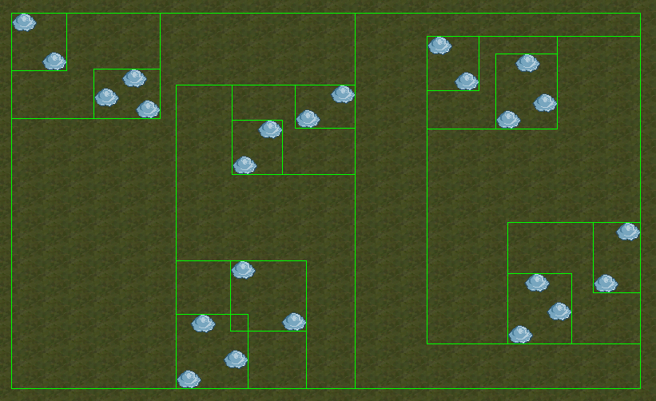

I am [Miquel Suau](https://www.linkedin.com/in/miquel-suau-gonz%C3%A0lez-346b5617a/), student of the [Bachelor’s Degree in Video Games by UPC at CITM](https://www.citm.upc.edu/ing/estudis/graus-videojocs/). This content is generated for the second year’s subject Project 2, under supervision of lecturer [Marc Garrigó](https://www.linkedin.com/in/mgarrigo/).

---
## Why is Space Partitioning necessary

Lets set a context here, lets say you have 100 objects in a scene, and some are really close, some are really far away. We as humans who can see distances, instinctively only look around an object to check if something is colliding with it, right?

Well computers can't do that, when we ask the computer to check collisions, it's pretty common to just make a double FOR loop and check every object with every other object in the scene (brute force). This results in an operating time of O(n²) which means that if we have 100 units, we'll need to compute O(100²) = 10.000 checks. Keep that number in mind.

Also note that we can't just ask the computer to get the distance of every object and then check only the closest ones, because... we would be iterating every object anyway so it would be even worst.

So, we don't want to work with O(n²) because if we start adding objects, checks can grow fast and create problems. We need to work with something like O(n log n), which is the operating time of a Quadtrees and AABB Trees. This means that in the same 100 unit's context, we just need to compute O(100 * log(100)) = 200, big improvement from 10.000 to 200 isn't it? (Keep in mind that usually Quad trees operate in O(log n), but we are checking every element of the leaf with every other element so we need to multiply that O(log n) with every element in the leaf).

 

This is a gif with a theroical tree construction:
	 
 

 

Keep in mind that if we are working with a limited number of objects and this number is relatively small, we could just brute force the checks. Trees are useful when we work with a dynamic unlimited number of objects. Also, a bad implemented tree can be slower than some brute force checks, so I recommend to read this page until the end.

Here is a small table to represent the big improvement:

| Units         | O(n²)              |  O(n log n)  |
| ------------- |:------------------:| ------------ |
| 100           | 10.000      checks | 200 checks   |
| 1.000         | 1.000.000   checks | 3.000 checks |
| 10.000        | 100,000,000‬ checks | 40.000 checks|

There's also lots of data tree structures, like Octree used in 3D space.

---
## Different approaches by different games

There are a lot of games using Space Partitioning these days, it's almost a "must", but in the old days of video games, space partitioning wasn't so common. Some games like **DOOM**, **Quake** and **Wolfenstein** used BSP implementations to render 3D graphics.

DOOM used a BSP (Binary Space Partitioning) tree to solve the VSD problem. This BSP allowed the DOOM developers to build complex 3D maps that could be rendered at real with slow PC's.

Wolfenstein in the other hand used a marching raycast method and build the maps in a grid, making the rendering process fast enought for slow computers, but this also created a limiting factor on the level design aspect in the game.

You can read more about VSD and BSP [here](https://twobithistory.org/2019/11/06/doom-bsp.html).

Also, any RTS game or any other game that manages large numbers of entities must use space partitioning to manage units, collisions, logic...

There is not a lot of info about it but games like [World War Z](https://www.epicgames.com/store/es-MX/product/world-war-z/home) must use some sort of space partitioning or ECS system to work with large ammounts of entities.

 

 

 

It's safe to say that almost any modern game engine uses trees for camera culling, collision detection, raycast rendering...
For instance, Unreal Engine 3 uses BSP trees.

---
## How can we solve this problem

So, space partitioning can lead to a lot of implementations depending on what you want to solve, if you are doing a 3D renderer, you want to solve something like the VSD problem and then you need to create some sort of BSP tree or frustrum culling to render a 3D space into a 2D surface.

 

Dungeon generation with BSP Tree:
	 
 

 

If you are dealing with large ammounts of objects for an RTS game, or any other game, maybe you want to work with AABB trees, Octrees (3D context) or QuadTrees (2D context).

In our case, we want the user to be able to deal with large ammounts of entities, like buildings, units, props...

We will create a QuadTree to manage static entities, and a AABBTree to manage everything related to dynamic entities (collision, culling, logic... ).

To start with this, we will work with some custom structs, like Point and Rect, some math functions and the .h and .cpp files provided [here](#lets-code-c-implementation).

We will create a working QuadTree and AABBTree and some functions to use them, recursivity will be a recursive topic here (pun intended).

---
## Custom trees documentation

Here you can find information for all the custom functions in the AABBTree and QuadTree classes, Point and Rect structs and MaykMath namespace:

#### AABB Tree data documentation

_AABBNode_
 

| Type         | Function Declaration    | Function description  |
| ------------ |:-----------------------:|:---------------------:|
| int          | GetData()               | Returns something     |

_AABBTree_
 

| Type         | Function Declaration    | Function description  |
| ------------ |:-----------------------:|:---------------------:|
| int          | GetData()               | Returns something     |

#### Quad Tree data documentation

_QuadNode_
 

| Type         | Function Declaration    | Function description  |
| ------------ |:-----------------------:|:---------------------:|
| int          | GetData()               | Returns something     |

_QuadTree_
 

| Type         | Function Declaration    | Function description  |
| ------------ |:-----------------------:|:---------------------:|
| int          | GetData()               | Returns something     |

#### Point struct documentation

| Type         | Function Declaration    | Function description  |
| ------------ |:-----------------------:|:---------------------:|
| float        |  DistanceManhattan(const Point& v) const  | Returns the Manhattan distance between two points |
| bool        |  IsZero()  | Returns true if X and Y are equal to 0 |
| float        |  operator*(Point const &b)   | Overrides the operator* to allow dot product between Points|

#### Rect struct documentation

| Type         | Function Declaration    | Function description  	      |
| ------------ |:-----------------------:|:----------------------------------:|
| Point        |  GetCentralPoint()      | Returns the rect's central point   |

#### MaykMath namespace documentation

| Type         | Function Declaration    | Function description  |
| ------------ |:-----------------------:|:---------------------:|
| Point| NegatedYVectorFromPoints(Point, Point)  | Calculate a vector from two points and invert the Y (we need this for OA detection)|
| float        | GetTriangleArea(Point, Point, Point)   | Calculate and return the area of any triangle  |
| bool  | IsPointInsideOffAxisRectangle(Point, Point, Point, Point, Point)| Returns true if the Point is inside an OA rectangle |
| bool        | IsPointInsideAxisAlignedRectangle(Rect, Point)   | Returns true is the point is inside the AA rectangle |
| bool        | CheckRectCollision(const Rect&, const Rect&)   | Returns true if the input rects are overlaping  |
| Point        |  GetMinPoint(Point, Point)   | Returns a Point with the minimum values of the two input Points  |
| Point        |  GetMaxPoint(Point, Point)   | Returns a Point with the maximum values of the two input Points  |

---
## Links to more documentation

To do this, you will need some knowlage about trees, recursivity and C++, this are some pages i recomend reading before starting with the code.

[Introductory Guide to AABB Tree Collision Detection](https://www.azurefromthetrenches.com/introductory-guide-to-aabb-tree-collision-detection/)

[Binary Search Trees](https://brilliant.org/wiki/binary-search-trees/)

Also read about the ways to find data in trees, for example, when we want to find the lowest nodes or leafs in our tree, we will use a recursive Depth-first search.

 

 

 

---
## LET'S CODE: C++ Implementation

**_TODO 0: Project Setup:_**

_WARNING:_ Keep in mind that debug mode can kill performance in visual studio. Don't trust me? Then let me show you some numbers:

| Check Method      | Units    | Debug Mode     | Release Mode |
| ----------------- |:--------:| --------------:| ------------:|
| Brute Force       | 1560     | ≃ 9.254,18 ms  | ≃ 52,41 ms  | 
| AABB Tree         | 1560     | ≃ 243,79 ms    | ≃ 6,04 ms   | 

 

_Brute Force:_

_AABB Tree::_

You can download the VS project with all the necessary files and the steps to complete the trees yourself [here](). The complete VS project with the trees working and the examples can we downloaded clicking [here](). If you want to download any file from the repository, you can go [here]().

##### **_NEVER remove the license or the name of the creator from the provided files. It's not your code, don't be "that" guy._**

Now, try to spawn some units, by default the project will use BRUTE FORCE collision detection. Can you feel the FPS dying? Cool, let's fix that.

**_TODO 1.1: Create tree variables:_**

**_TODO 1.2: Initialize quadTree:_**

**_TODO 2: Create a way to draw the trees for debugging:_**

**_TODO 3: Make sure to update all the AABBTree nodes:_**

**_TODO 4: Fill the code for CreateBuilding() method:_**

Make sure that two buildings can't spawn in the same tile

**_TODO 5: Fill the code for CreateUnit() method:_**

Make sure that two units can't spawn in the same position

**_TODO 6.1: Complete the missing code in the AABBTree::SubDivide() method:_**

  

**_TODO 6.2: Complete the missing code in the QuadTree::SubDivide() method:_**

  

**_TODO 7: Test collision detection in Debug and Release mode:_**

There will be a big difference in time between debug and release mode, keep that in mind.

  

**_TODO 8: Test (el que sigui que fagi el quadtree amb les unitats):_**

**_TODO 9: Take some time to understand the code:_**

You will modify the code will you? Then take some time to understand all the code. I tried to comment everything.

---
## Homework

If you think that this is an interesting subject to work on, I dare you to take my code and optimize it, feel free to play around with it, I tried to make it as c++ independent by avoiding std's so it's easy to move to other languages. If you can get it running in a more efficient way (which I'm sure can be done, like really sure), please contact me so I can update the code and credit you properly, let's work together to make this code as fast as possible.

This tree structure can be modified to do anything you need, from 2D camera culling, to area attacks (to reduce the number of collision checks)...

---
## Explanation of any other improvements on the system

As we all know, this trees aren't perfect, there is a lot of room to work with, but this files povide a way to make anything you want, with just some knowlege about trees. The most important method in both clases is the one that loads the lowest leaf nodes inside a point. This gives you almost any information you need to work with in this kind of projects.

**I dont know any more improvements lmao**

---
### Sources
[Medieval Building 01 - Bleed's Game Art](https://opengameart.org/content/medieval-building-01-bleeds-game-art-0)

[DOOM under the hood](https://www.youtube.com/watch?v=e0W65ScZmQw)

[Fantasy isometric tileset](https://pixelation.org/index.php?topic=15067.0)

# THINGS TO TALK ABOUT

Making the list of entities not pointers also goes brbrbr, but if you are using polymorphism you must work with pointers.
